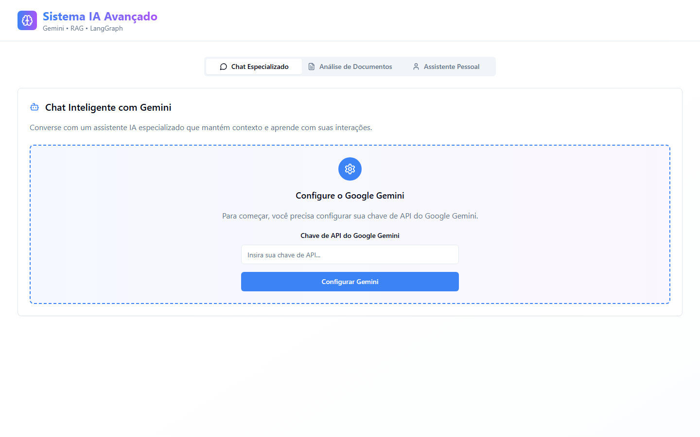

# Gemini Beyond Prompts

**Demo:** https://gemini-beyond-prompts.vercel.app

> © 2025–2026 Renan Augusto dos Santos. **Todos os direitos reservados.** Código público apenas para avaliação de portfólio: copiar, adaptar ou reutilizar exige autorização por escrito. Veja [Licença e direitos autorais](#licença-e-direitos-autorais).



Protótipo de um painel de IA que vai além do campo de prompt, com três módulos: chat com o Google Gemini, análise de documentos no estilo RAG e um assistente com agentes inspirado no LangGraph. O chat conversa de verdade com a API do Gemini. Os outros dois módulos são protótipos de interface, com o processamento simulado no navegador; o banco para a versão completa (Supabase com pgvector) já está modelado.

## O que dá para fazer

| Aba | Situação | Fluxo |
| --- | --- | --- |
| **Chat Especializado** | Funcional | Informe a sua chave da API do Gemini e converse. A chave fica só na memória da aba e vai direto do navegador para a API do Google. As últimas mensagens seguem no prompt como contexto da conversa. |
| **Análise de Documentos** | Protótipo | Envio de vários arquivos com progresso, biblioteca com resumo e busca. Arquivos de texto são lidos no navegador; PDF e Word mostram um conteúdo de exemplo, e a busca filtra por palavra-chave com uma nota de relevância ilustrativa. |
| **Assistente Pessoal** | Protótipo | Agentes de pesquisa, planejamento e execução, workflows (como uma pesquisa de mercado em três etapas) e tarefas com prioridade e status. A execução é simulada com temporizadores. |

## Stack

React 18 · TypeScript · Vite 5 · Tailwind CSS 3 · shadcn/ui · TanStack Query · React Router · Google Generative AI SDK (`@google/generative-ai`, modelo `gemini-3.6-flash`) · Supabase (cliente e migrations).

## Arquitetura

```
src/
├── components/
│   ├── ChatInterface.tsx       # chat com o Gemini e contexto da conversa
│   ├── DocumentAnalysis.tsx    # envio, biblioteca e busca (protótipo)
│   ├── PersonalAssistant.tsx   # agentes, workflows e tarefas (protótipo)
│   ├── Layout.tsx              # cabeçalho e abas
│   └── ui/                     # componentes shadcn/ui
├── lib/gemini.ts               # cliente do Gemini: modelo de chat e embeddings
├── lib/supabase.ts             # cliente do Supabase
└── integrations/supabase/      # tipos gerados do banco
supabase/migrations/            # profiles, documents (embeddings VECTOR(768)), agents, workflows e tasks, com RLS
```

## Rodando localmente

```bash
npm install
npm run dev          # http://localhost:8080
```

| Script | O que faz |
| --- | --- |
| `npm run build` | Build de produção |
| `npm run build:dev` | Build em modo de desenvolvimento |
| `npm run lint` | ESLint |
| `npm run preview` | Serve o build local |

A chave do Gemini não fica no código nem em variáveis de ambiente: ela é informada na própria tela. Gere uma no [Google AI Studio](https://aistudio.google.com/app/apikey). O `.env` traz só a URL e a chave pública (publishable) do projeto Supabase, que o cliente do navegador usa.

## Premissas e limites

- Só o chat chama um modelo de IA. A análise de documentos e o assistente ainda não usam o Gemini.
- A função de embeddings (`generateEmbedding`) existe em `src/lib/gemini.ts`, mas ainda não é chamada.
- O banco está modelado nas migrations, mas a aplicação ainda não grava nada: documentos, conversas e tarefas ficam na memória e somem ao recarregar.

## Evolução possível

Extração real de texto de PDF e Word, embeddings gravados no pgvector com busca por similaridade, agentes executando etapas com o Gemini, login com o Supabase Auth e histórico persistente. São próximos passos, não recursos implementados.

## Autoria

Concepção, prompts e direção do projeto por **Renan Augusto dos Santos** ([renanaugusto.com.br](https://renanaugusto.com.br) · [contato@renanaugusto.com.br](mailto:contato@renanaugusto.com.br)). A base do código foi gerada com o Lovable, ferramenta de desenvolvimento com IA, a partir dessas instruções.

## Licença e direitos autorais

© 2025–2026 Renan Augusto dos Santos. **Todos os direitos reservados.**

Este não é um projeto open source. O código está público apenas para fins de portfólio e avaliação profissional. Sem autorização por escrito, não é permitido:

- copiar, modificar, redistribuir ou usar comercialmente o projeto, no todo ou em parte;
- reescrever o projeto em outra stack a partir deste repositório, ou reutilizar a interface, os prompts e os textos;
- apresentar o projeto, ou parte dele, como trabalho próprio em portfólios, processos seletivos ou propostas comerciais;
- usar o conteúdo do repositório ou da demo para treinar ou avaliar modelos de IA.

Os termos completos estão em [LICENSE](LICENSE). Dependências e componentes de terceiros mantêm suas próprias licenças. Pedidos de autorização: [contato@renanaugusto.com.br](mailto:contato@renanaugusto.com.br).

---

## 🇺🇸 English

Gemini Beyond Prompts is an AI dashboard prototype by **Renan Augusto dos Santos**, with three modules: a chat backed by the Google Gemini API, a RAG-style document analysis screen and an assistant with agents inspired by LangGraph. The chat calls Gemini for real (your API key stays in the tab's memory); the document and assistant modules are interface prototypes with simulated processing, and the database for the full version (Supabase with pgvector) is already modeled. Built with React 18, TypeScript, Vite, Tailwind CSS and shadcn/ui.

© 2025–2026 Renan Augusto dos Santos. All rights reserved. This is not open source. The source is public for portfolio evaluation only; copying, modifying, porting, redistributing, commercial use, presenting it as your own work or using it to train AI models requires written permission. See [LICENSE](LICENSE). Contact: [contato@renanaugusto.com.br](mailto:contato@renanaugusto.com.br) · [renanaugusto.com.br](https://renanaugusto.com.br).
